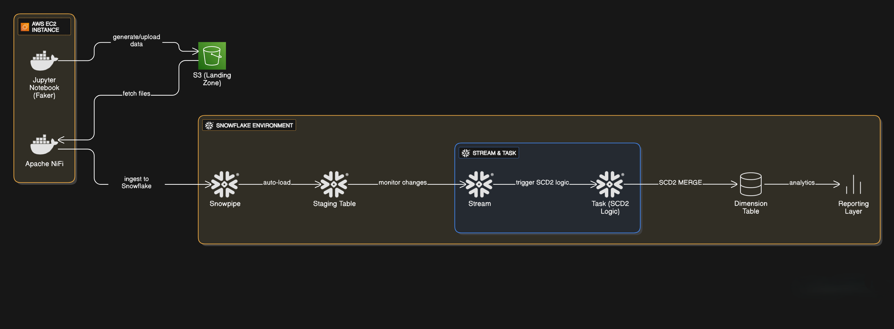

# 🚀 AWS–NiFi–Snowflake SCD Type 2 Data Pipeline

### 📊 End-to-End Data Pipeline for Slowly Changing Dimensions (SCD Type 2)

This project demonstrates a **real-world data engineering pipeline** built on **AWS and Snowflake**, implementing **Slowly Changing Dimensions (SCD Type 2)** to maintain historical data.  
The pipeline automates data ingestion, transformation, and historical tracking using **Dockerized NiFi and Jupyter Notebook** running on an **EC2 instance**.

---

## 🧱 Architecture Overview




### 🔹 Data Flow Summary

1. **Data Generation (EC2 - Jupyter Notebook)**  
   - Synthetic data is generated using Python’s `Faker` library inside a Jupyter Notebook container.  
   - Data is saved in CSV format and uploaded to an **AWS S3 bucket**.

2. **Data Ingestion (EC2 - Apache NiFi in Docker)**  
   - **Apache NiFi**, running in another Docker container on EC2, monitors the S3 bucket for new files.  
   - When a new file arrives, NiFi triggers a flow to push the data into **Snowflake** using **Snowpipe**.

3. **Data Loading (Snowflake - Snowpipe)**  
   - **Snowpipe** automatically loads new data from S3 into a **staging table** in Snowflake.

4. **Change Tracking (Snowflake - Stream & Task)**  
   - A **Stream** tracks all inserts and updates in the staging table.  
   - A **Task** runs an **SCD Type 2 MERGE SQL process** that inserts historical versions into the dimension table.

5. **Data Warehouse (Snowflake - Dimension Table)**  
   - The final **dimension table** stores both **current and historical** data with columns like:
     - `surrogate_key`
     - `business_key`
     - `attributes` (e.g., name, city, email)
     - `start_date`, `end_date`, `is_current`

---

## ⚙️ Tech Stack

| Layer | Tool / Service | Purpose |
|:------|:----------------|:--------|
| **Compute** | AWS EC2 | Host NiFi & Jupyter (via Docker) |
| **Data Storage** | AWS S3 | Store raw data files |
| **Orchestration / ETL** | Apache NiFi | Automate ingestion from S3 → Snowflake |
| **Data Warehouse** | Snowflake | Store, track, and query historical data |
| **Change Tracking** | Snowflake Streams & Tasks | Detect changes and apply SCD2 logic |
| **Containerization** | Docker | Run NiFi & Jupyter Notebook environments |
| **Data Generation** | Python (Faker library) | Generate mock data for ingestion |

---

## 🧠 Slowly Changing Dimensions (Type 2)

SCD Type 2 ensures **no data loss** when an attribute changes.  
Instead of overwriting, the old record is **closed** and a new version is **inserted**, keeping full history.

---

## 🔁 Pipeline Workflow

```text
1️⃣ Jupyter (Docker) → generates data → uploads to S3
2️⃣ NiFi (Docker) → reads S3 → pushes to Snowflake (via Snowpipe)
3️⃣ Snowpipe → loads to staging table
4️⃣ Stream → tracks new/changed rows
5️⃣ Task → merges into dimension table using SCD Type 2 logic
